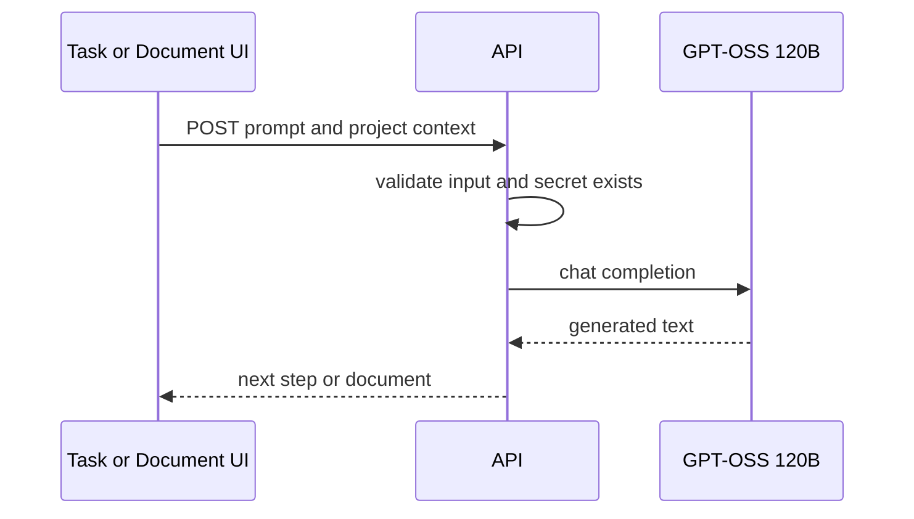

# API

| Route | Method | Purpose |
|---|---:|---|
| `/api/health` | GET | API/model readiness |
| `/api/github/connect` | GET | Start GitHub OAuth |
| `/api/github/callback` | GET | OAuth callback |
| `/api/auth/session` | GET | Read temporary OAuth session profile |
| `/api/github/repos` | GET | List connected GitHub repositories |
| `/api/tasks` | GET/POST | List/create lightweight tasks |
| `/api/tasks/next-step` | POST | Generate next step with Groq |
| `/api/documents` | GET | List generated documents |
| `/api/documents/generate` | POST | Generate Markdown document with Groq |

## AI workflow

Never send `GROQ_API_KEY` to the browser.
