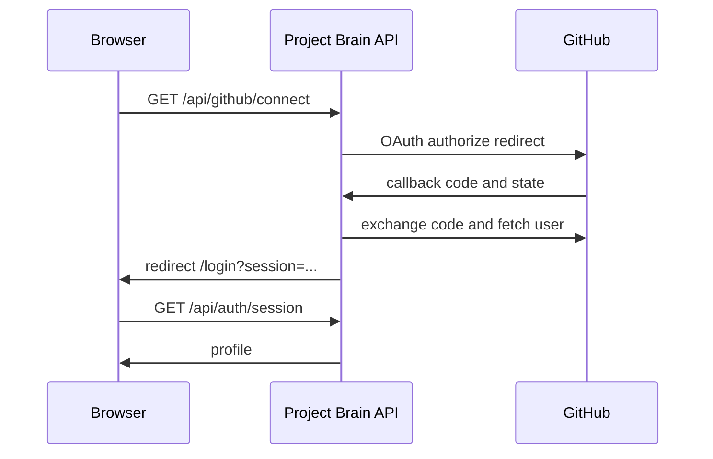

# Architecture

## Folder structure

```text
api/                 Vercel serverless entry point
server/              Express application and local API runner
src/components/      Shell and reusable UI
src/pages/           Route-level React pages
public/              Logo and static assets
task ui/             Supplied design references
```



React routes are protected client-side after a local session marker is created. API routes must still enforce authorization before production release.
