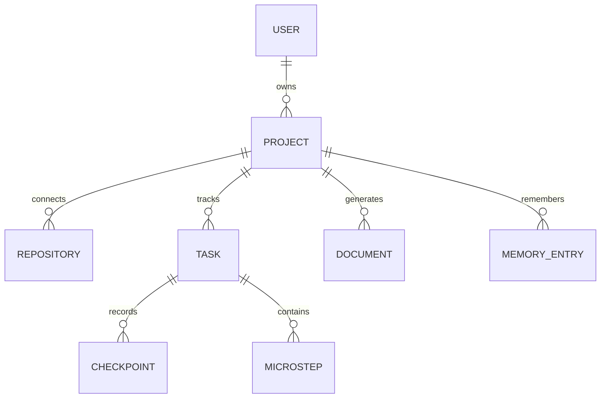

# Deployment

## Netlify

`netlify.toml` builds with `npm run build`, publishes `dist`, and supplies a SPA fallback. The Express API is not automatically hosted by Netlify; deploy it separately or use Vercel for the API.

## Vercel

`vercel.json` provides SPA rewrites and `api/index.js` exports the Express application as a serverless function. Configure these environment variables in Vercel:

- `GITHUB_CLIENT_ID`
- `GITHUB_CLIENT_SECRET`
- `GROQ_API_KEY`
- `APP_URL` set to the deployed origin

Update the GitHub OAuth callback to `https://your-domain/api/github/callback`.

## Database future state

The MVP state is in-memory. Production persistence should model the following:

Use a managed Postgres database with encrypted OAuth tokens and row-level ownership.
