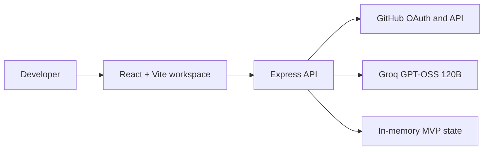

# System Design

## Context

DevPal AI is a React workspace with an Express API. GitHub provides identity and repository access. Groq powers task suggestions and document drafts.

## Components

| Component | Responsibility |
|---|---|
| Web client | Public landing, auth UI, dashboard, task and document workflows |
| API | OAuth exchange, GitHub queries, task/document endpoints |
| GitHub | OAuth identity and repository metadata |
| Groq | AI next-step and Markdown document generation |

## Technical debt

In-memory sessions/tasks/documents reset on cold starts. Production needs encrypted token storage, persistent database, CSRF/session hardening, rate limiting, and observability.
